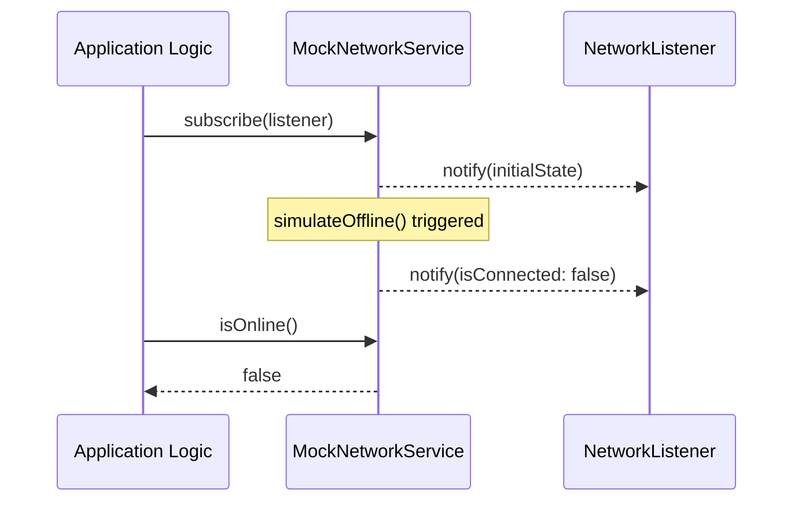

# POC: Connectivity Monitor Utility

## Overview
This module provides a decoupled, interface-driven approach to monitoring network connectivity in the TAP Buddy application. By abstracting the network state behind `INetworkService`, we ensure that the core application logic (such as the Sync Engine) remains agnostic of the specific library used for network detection (e.g., `@react-native-community/netinfo`).

## Architecture

### Interface-Driven Design
The module defines a strict `INetworkService` interface:
```typescript
export interface INetworkService {
  getNetworkState(): NetworkState;
  isOnline(): boolean;
  subscribe(listener: NetworkChangeListener): () => void;
}
```

### Mock Implementation
A `MockNetworkService` is provided to facilitate development and testing without requiring a physical device or real network transitions.



## Why This Matters
- **Testability:** Allows simulating flaky connections and offline states in unit tests.
- **Maintainability:** If we decide to switch network monitoring libraries in the future, we only need to implement a new version of `INetworkService` without touching the rest of the codebase.
- **Decoupling:** Prevents the Sync Engine from being tightly coupled to React Native native modules during the PoC phase.

## Usage
```typescript
const network = new MockNetworkService();

network.subscribe((state) => {
  console.log('Connection status changed:', state.isConnected);
});

network.simulateOffline(); // Triggers listener
```
