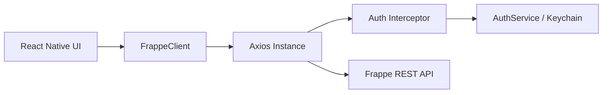

# Typed Frappe API Client (PoC)

This directory contains the Proof of Concept (PoC) for Issue #18: **Typed Frappe API Client and Secure Authentication Layer**.

## Overview

This module provides a centralized, type-safe way to communicate with the Frappe LMS backend. It focuses on:
1.  **Secure Credential Handling**: Abstract interface for `api_key:api_secret` storage.
2.  **Request Interceptors**: Automatic injection of Authorization headers.
3.  **Response Interceptors**: Centralized handling of `401/403` unauthorized errors.
4.  **TypeScript Models**: Strongly typed DocTypes (Course, Lesson, User).

## Architecture



## Setup & Testing

1.  Install dependencies:
    ```bash
    cd poc-frappe-api
    npm install
    ```
2.  Run unit tests:
    ```bash
    npm test
    ```

## Key Files
- `src/models/index.ts`: TypeScript interfaces for LMS resources.
- `src/AuthService.ts`: Credential management logic.
- `src/FrappeClient.ts`: Main API client with interceptors.
- `tests/FrappeClient.test.ts`: Interceptor and error handling tests.
