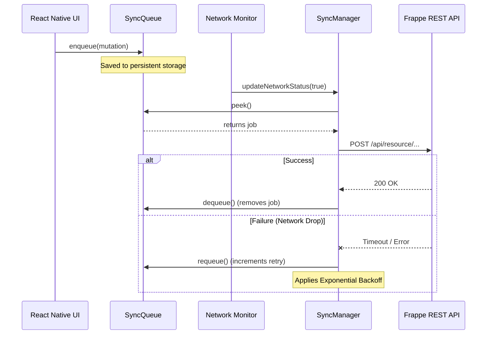

# Offline-First Sync Engine (PoC)

This directory contains the Proof of Concept (PoC) for Issue #1: **Offline-First Sync Engine: Queue-Based Write Architecture**.

As per the contribution guidelines, this PoC is built as a **standalone TypeScript module**. It does not pollute the main repository scaffolding, allowing it to be unit-tested and reviewed in isolation before being integrated into the React Native app.

## Architecture & Sequence

This module handles the core complexities of the offline-first requirement:
1. Enqueuing local writes.
2. Waiting for network restoration.
3. Automatically draining the queue with exponential backoff on failure.

### Sequence Diagram



## Running the PoC Tests

Since this is a standalone logic module, we verify its behavior using Jest.

1. Install dependencies:
   ```bash
   cd poc-sync-engine
   npm install
   ```
2. Run the unit & simulation tests:
   ```bash
   npm test
   ```

## Files
- `src/SyncQueue.ts` - Manages the FIFO queue logic.
- `src/SyncManager.ts` - Handles the network state monitoring, draining, and exponential backoff retry logic.
- `tests/SyncManager.test.ts` - Jest tests simulating offline/online transitions.
